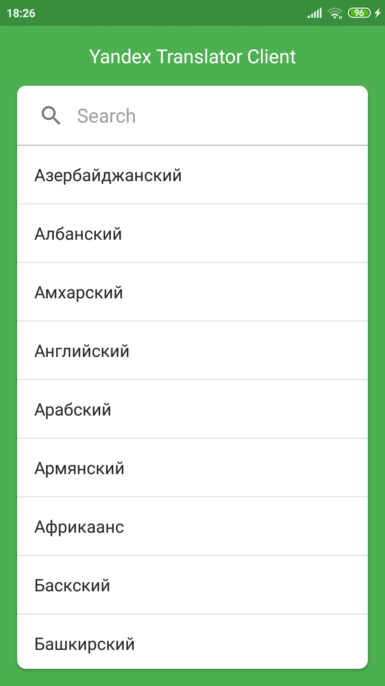
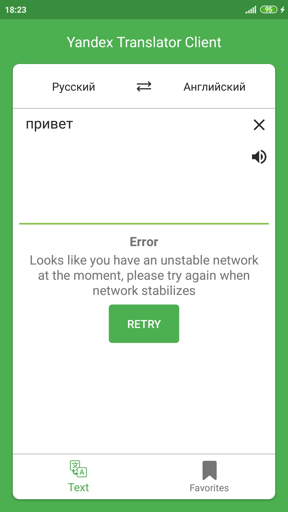
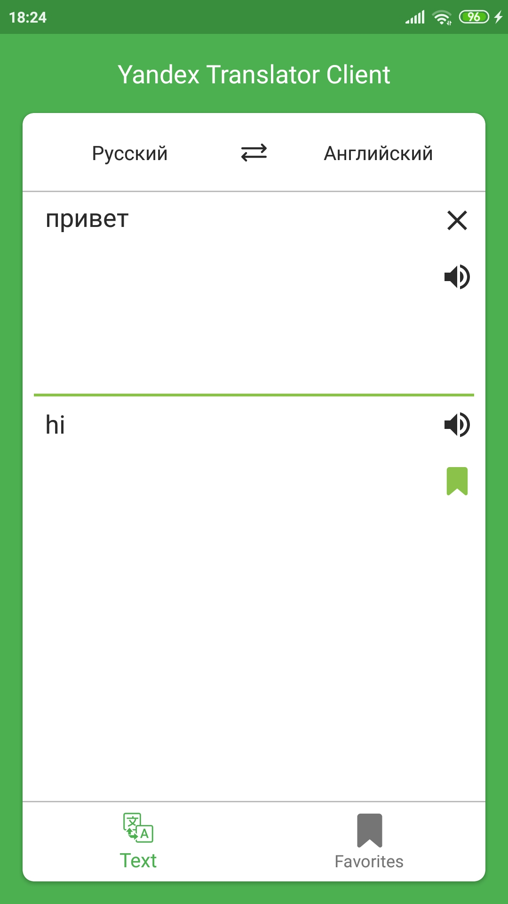
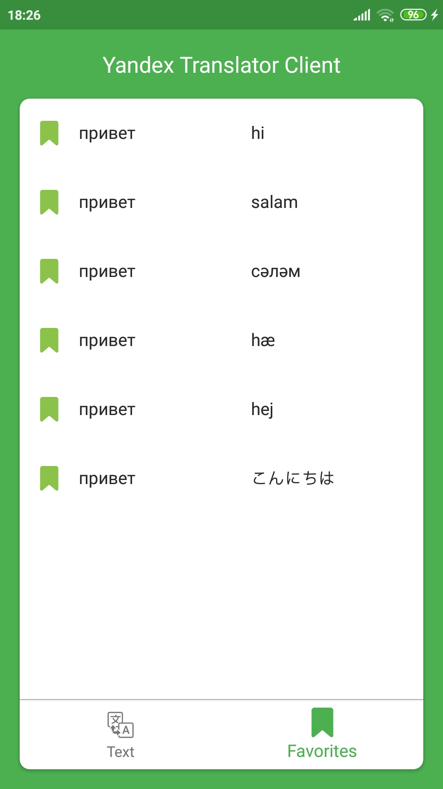

# translator-app
Клиент Яндекс.Переводчика.

## Описание приложения
Три экрана, представляют собой acitvities. (Single activity и Navigation component не использованны, так как хотелось попробовать что-то новое)
1. Экран выбора языка: получает список доступных языков для перевода, помещает их в адаптер и сортирует в алфавитном порядке. SearchView позволяет найти нужный язык. При клике на язык возвращает на экран перевода. 

2. Экран перевода: отправляет на сервер запрос, с задержкой 500 мс, чтобы сократить количество запросов, обрабатывает ошибки с помощью RxJava. Поддерживает Text-to-speech (Сделано скорее для галочки, чтобы приложение не было сухим). После получения ответа сверяется с базой данных и отображает, есть ли введенный текст в закладках. Можно очистить поля ввода и вывода текста, удалять и добавлять пару текстов в закладки.

 

3. Экран закладок: отображает добавленные в базу данных пары текстов, которые можно удалить.

Цель проекта - изучить следующие технологии:
* Dagger
* Retrofit

И попрактиковать Rxjava. Также была использованна Room.

